# Copilot Engineer Pessoal — Documento de Arquitetura e Implementação

> **Versão:** 1.0  
> **Data:** 2026-03-11  
> **Autor:** Arquitetura gerada para contexto .NET/C#, microsserviços, SQL Server, PostgreSQL, Docker, Azure DevOps

---

## Sumário

1. [Definição: O que é um Copilot Engineer Pessoal](#1-definição-o-que-é-um-copilot-engineer-pessoal)
2. [Arquitetura da Solução](#2-arquitetura-da-solução)
3. [Especialistas Recomendados](#3-especialistas-recomendados)
4. [Memória e Contexto Pessoal](#4-memória-e-contexto-pessoal)
5. [Workflows Práticos](#5-workflows-práticos)
6. [MVP Realista](#6-mvp-realista)
7. [Roadmap Evolutivo](#7-roadmap-evolutivo)
8. [Estrutura de Projeto](#8-estrutura-de-projeto)
9. [Exemplos de Prompts-Base](#9-exemplos-de-prompts-base)
10. [Regras Operacionais](#10-regras-operacionais)

---

## 1. Definição: O que é um Copilot Engineer Pessoal

### 1.1 Conceito

Um **Copilot Engineer Pessoal** é um sistema multi-agente orquestrado que atua como um engenheiro de software assistente, com memória persistente, conhecimento contextualizado do seu projeto e capacidade de executar ações concretas no seu ambiente de desenvolvimento.

### 1.2 Diferenças em relação a abordagens existentes

| Dimensão | Chat LLM Comum | GitHub Copilot / Copilot Chat | Copilot Engineer Pessoal |
|---|---|---|---|
| **Contexto** | Apenas a conversa atual | Arquivo aberto + workspace limitado | Projeto inteiro + histórico de decisões + ADRs + convenções + bugs resolvidos |
| **Memória** | Nenhuma entre sessões | Nenhuma entre sessões | Persistente: padrões, decisões, erros passados, queries frequentes |
| **Especialização** | Generalista | Generalista com viés de código | Agentes especializados por domínio (DB, arquitetura, debug, CI/CD, docs) |
| **Ação** | Texto puro | Sugestão inline / edição pontual | Pode executar queries, rodar testes, analisar logs, criar PRs, gerar documentação |
| **Orquestração** | Manual (você dirige) | Nenhuma | Workflow engine que coordena múltiplos agentes para tarefas complexas |
| **Ferramentas** | Nenhuma ou poucas | LSP + codebase indexing | MCP servers, CLI tools, DB connections, Azure DevOps API, Docker, git |
| **Proatividade** | Reativo | Reativo | Pode ser acionado por eventos (PR criado, build falhou, nova issue) |

### 1.3 Analogia prática

Pense no Copilot Engineer como a diferença entre perguntar algo a um colega aleatório vs. ter um engenheiro sênior que já trabalha no seu projeto há 6 meses. Ele sabe:

- A estrutura do repositório e as convenções do time
- As decisões arquiteturais e seus trade-offs (ADRs)
- Os bugs que já apareceram e como foram resolvidos
- Os padrões de query mais usados e seus problemas de performance
- As pipelines de CI/CD e suas peculiaridades
- Quem é responsável pelo quê

---

## 2. Arquitetura da Solução

### 2.1 Visão em Camadas

```mermaid
graph TB
    subgraph "Interface Layer"
        CLI["CLI / Terminal"]
        VSCODE["VS Code Extension"]
        CHAT["Chat Interface"]
        WEBHOOK["Webhooks (Azure DevOps, Git)"]
    end

    subgraph "Orchestration Layer"
        CORE["Engineer Core<br/>(Orquestrador Principal)"]
        WF["Workflow Engine"]
        ROUTER["Intent Router"]
    end

    subgraph "Specialist Agents Layer"
        ARCH["Architecture<br/>Specialist"]
        DB["Database<br/>Specialist"]
        DEBUG["Debug<br/>Specialist"]
        CICD["CI/CD<br/>Specialist"]
        DOC["Documentation<br/>Specialist"]
        CODE["Code<br/>Specialist"]
        TEST["Test<br/>Specialist"]
    end

    subgraph "Skills Layer"
        S1["SQL Analysis"]
        S2["Code Review"]
        S3["ADR Generation"]
        S4["Test Generation"]
        S5["Refactoring"]
        S6["Log Analysis"]
        S7["Pipeline Repair"]
        S8["Estimation"]
    end

    subgraph "Tools & MCP Layer"
        MCP_GIT["MCP: Git"]
        MCP_FS["MCP: Filesystem"]
        MCP_DB["MCP: Database"]
        MCP_AZ["MCP: Azure DevOps"]
        MCP_DOCKER["MCP: Docker"]
        MCP_SEARCH["MCP: Web Search"]
        TOOL_DOTNET["Tool: dotnet CLI"]
        TOOL_SQLCMD["Tool: sqlcmd/psql"]
    end

    subgraph "Memory Layer"
        PM["Project Memory<br/>(Arquitetura, ADRs, Convenções)"]
        EM["Episodic Memory<br/>(Bugs resolvidos, decisões)"]
        SM["Semantic Memory<br/>(Embeddings de código/docs)"]
        WM["Working Memory<br/>(Contexto da tarefa atual)"]
    end

    CLI --> ROUTER
    VSCODE --> ROUTER
    CHAT --> ROUTER
    WEBHOOK --> ROUTER

    ROUTER --> CORE
    CORE --> WF
    CORE --> ARCH
    CORE --> DB
    CORE --> DEBUG
    CORE --> CICD
    CORE --> DOC
    CORE --> CODE
    CORE --> TEST

    ARCH --> S1 & S2 & S3 & S5 & S8
    DB --> S1
    DEBUG --> S2 & S6
    CICD --> S7
    DOC --> S3
    CODE --> S2 & S4 & S5
    TEST --> S4

    S1 --> MCP_DB & TOOL_SQLCMD
    S2 --> MCP_GIT & MCP_FS
    S3 --> MCP_FS
    S6 --> MCP_DOCKER & MCP_AZ
    S7 --> MCP_AZ

    CORE --> PM & EM & SM & WM
    ARCH --> PM
    DB --> SM
    DEBUG --> EM
```

### 2.2 Descrição de cada camada

#### Interface Layer

Pontos de entrada para interação com o sistema. O ideal é que o CLI seja o primeiro a ser implementado (menor atrito), seguido pela extensão VS Code.

| Interface | Tecnologia Sugerida | Prioridade |
|---|---|---|
| CLI | Python (Click/Typer) ou Node.js (Commander) | P0 — MVP |
| VS Code Extension | TypeScript + VS Code API | P1 |
| Chat Web | React + WebSocket | P2 |
| Webhooks | Azure Functions ou FastAPI endpoint | P2 |

#### Orchestration Layer — Engineer Core

O **Engineer Core** é o cérebro do sistema. Ele recebe a intenção do usuário, decide qual(is) especialista(s) acionar, monta o contexto necessário (puxando da memória), orquestra a execução e consolida a resposta.

Responsabilidades:
- **Intent Classification**: Classificar a intenção do usuário (debug, arquitetura, SQL, docs, etc.)
- **Context Assembly**: Montar o contexto necessário a partir das memórias
- **Agent Routing**: Decidir quais agentes chamar e em que ordem
- **Response Consolidation**: Unificar as respostas dos agentes
- **Guardrail Enforcement**: Aplicar regras de segurança e confirmação

Implementação sugerida: **Semantic Kernel (C#)** como framework de orquestração, por afinidade com seu stack .NET.

```csharp
// Pseudo-código — Engineer Core com Semantic Kernel
public class EngineerCore
{
    private readonly Kernel _kernel;
    private readonly IMemoryStore _memory;
    private readonly IIntentRouter _router;
    private readonly IWorkflowEngine _workflows;

    public async Task<EngineResponse> ProcessAsync(UserRequest request)
    {
        // 1. Classificar intenção
        var intent = await _router.ClassifyAsync(request);

        // 2. Montar contexto da memória
        var context = await _memory.AssembleContextAsync(intent, request);

        // 3. Verificar se é um workflow composto
        if (_workflows.HasWorkflow(intent.Type))
        {
            return await _workflows.ExecuteAsync(intent, context);
        }

        // 4. Rotear para especialista
        var agent = _router.ResolveAgent(intent);
        return await agent.ExecuteAsync(request, context);
    }
}
```

#### Specialist Agents Layer

Cada agente é uma instância LLM com system prompt especializado, acesso a skills e tools específicos, e capacidade de consultar a memória.

#### Skills Layer

Skills são funções reutilizáveis e compostas que os agentes podem invocar. Cada skill encapsula uma capacidade específica e bem definida.

```csharp
// Exemplo de Skill — SQL Analysis
[KernelFunction("analyze_sql_query")]
[Description("Analisa uma query SQL quanto a performance, índices e plano de execução")]
public async Task<SqlAnalysisResult> AnalyzeSqlQuery(
    [Description("Query SQL a ser analisada")] string query,
    [Description("Banco alvo: sqlserver ou postgresql")] string engine,
    [Description("Incluir plano de execução real")] bool includeExecutionPlan = false)
{
    // 1. Parse da query (validação sintática)
    // 2. Obter plano de execução estimado via MCP:Database
    // 3. Analisar índices ausentes
    // 4. Gerar recomendações
    // 5. Retornar resultado estruturado
}
```

#### Tools & MCP Layer

Ferramentas concretas que executam ações no ambiente. MCP (Model Context Protocol) servers são o padrão de integração:

| MCP Server | Função | Implementação |
|---|---|---|
| `mcp-server-filesystem` | Ler/escrever arquivos do projeto | Existente (community) |
| `mcp-server-git` | Operações git (diff, log, blame, branch) | Existente (community) |
| `mcp-server-sqlite` / `mcp-server-postgres` | Conexão e queries em bancos de dados | Existente (community) + custom para SQL Server |
| `mcp-server-azure-devops` | Work items, PRs, pipelines, builds | Custom (a desenvolver) |
| `mcp-server-docker` | Listar containers, logs, exec | Custom ou community |
| `mcp-server-dotnet` | `dotnet build`, `dotnet test`, análise de projeto | Custom |
| `mcp-server-sequential-thinking` | Raciocínio passo-a-passo para problemas complexos | Existente (Anthropic) |

#### Memory Layer

A memória é o diferencial crítico que transforma o sistema de "chat com tools" para "engenheiro assistente". Quatro tipos compõem a memória:

| Tipo | Conteúdo | Persistência | Acesso |
|---|---|---|---|
| **Project Memory** | Arquitetura, ADRs, convenções, stack, dependências, estrutura de pastas | Arquivo (YAML/JSON) versionado no repo | Leitura por todos os agentes |
| **Episodic Memory** | Bugs resolvidos, incidentes, decisões pontuais, refatorações feitas | SQLite ou JSON-Lines com embeddings | Busca semântica |
| **Semantic Memory** | Embeddings de código, documentação, queries SQL indexadas | Vector store (ChromaDB, Qdrant, ou pgvector) | Busca por similaridade |
| **Working Memory** | Contexto da tarefa em andamento, resultados parciais, decisões intermediárias | Em memória (session) | Apenas sessão atual |

---

## 3. Especialistas Recomendados

### 3.1 Mapa de Especialistas

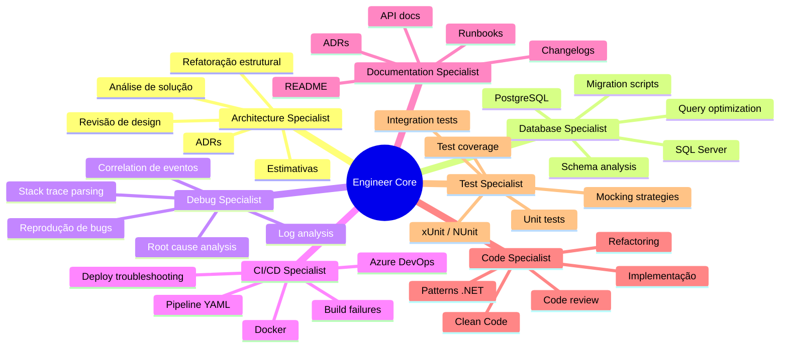

### 3.2 Detalhamento de cada Especialista

#### Architecture Specialist

| Campo | Valor |
|---|---|
| **Responsabilidade** | Analisar e propor decisões arquiteturais, revisar design de APIs e microsserviços, gerar ADRs, estimar complexidade, propor refatorações estruturais |
| **Gatilhos** | "como arquitetar", "propor solução", "revisar design", "ADR", "trade-off", "estimar", "qual padrão usar", nova feature complexa |
| **Skills** | `analyze_architecture`, `generate_adr`, `estimate_complexity`, `propose_refactoring`, `review_api_design` |
| **Tools / MCPs** | `mcp-filesystem` (ler estrutura do projeto), `mcp-git` (histórico de mudanças), Project Memory |
| **Contexto necessário** | Estrutura do projeto, ADRs existentes, dependências entre serviços, convenções do time, stack tecnológico |

```yaml
# Exemplo de contexto que o Architecture Specialist recebe
project:
  name: "order-service"
  type: "microservice"
  framework: ".NET 8"
  patterns: ["CQRS", "MediatR", "Repository Pattern"]
  dependencies:
    - service: "payment-service"
      protocol: "gRPC"
    - service: "notification-service"
      protocol: "RabbitMQ"
  database: "SQL Server"
  hosting: "AKS (Azure Kubernetes Service)"
adrs:
  - "ADR-001: Adoção de CQRS para separação de leitura/escrita"
  - "ADR-005: Uso de Outbox Pattern para consistência eventual"
conventions:
  api_versioning: "URL path (/v1/, /v2/)"
  error_handling: "ProblemDetails (RFC 7807)"
  authentication: "JWT via Azure AD"
```

#### Database Specialist

| Campo | Valor |
|---|---|
| **Responsabilidade** | Analisar queries SQL (performance, índices, plano de execução), revisar schemas, propor migrações, otimizar stored procedures, diagnosticar deadlocks e bloqueios |
| **Gatilhos** | "otimizar query", "analisar SQL", "índice", "migration", "deadlock", "lento", "plano de execução", "N+1" |
| **Skills** | `analyze_sql_query`, `suggest_indexes`, `review_schema`, `generate_migration`, `explain_execution_plan`, `detect_n_plus_one` |
| **Tools / MCPs** | `mcp-database` (SQL Server e PostgreSQL), `mcp-filesystem` (ler migrations existentes) |
| **Contexto necessário** | Engine de banco (SQL Server vs PostgreSQL), schema atual, migrations recentes, queries problemáticas anteriores, volume de dados aproximado |

```json
// Exemplo de payload de análise de query
{
  "action": "analyze_query",
  "engine": "sqlserver",
  "query": "SELECT o.*, c.Name FROM Orders o JOIN Customers c ON o.CustomerId = c.Id WHERE o.Status = 'Pending' AND o.CreatedAt > '2025-01-01'",
  "context": {
    "table_orders_rows": "~2M",
    "table_customers_rows": "~50K",
    "existing_indexes": [
      "IX_Orders_CustomerId",
      "PK_Orders_Id"
    ],
    "known_issues": [
      "Missing index on Orders.Status + CreatedAt (identificado em 2025-06)"
    ]
  }
}
```

#### Debug Specialist

| Campo | Valor |
|---|---|
| **Responsabilidade** | Investigar bugs, analisar stack traces, correlacionar logs, propor hipóteses de causa raiz, sugerir reprodução, analisar memory dumps |
| **Gatilhos** | "bug", "erro", "exception", "stack trace", "não funciona", "falhou", "investigar", "reproduzir", "500", "timeout" |
| **Skills** | `analyze_stack_trace`, `correlate_logs`, `propose_root_cause`, `suggest_reproduction`, `analyze_error_patterns` |
| **Tools / MCPs** | `mcp-filesystem` (logs), `mcp-docker` (logs de containers), `mcp-git` (blame, diff recente), `mcp-azure-devops` (builds, releases) |
| **Contexto necessário** | Stack trace completo, logs relevantes, mudanças recentes (git log), bugs similares já resolvidos (Episodic Memory), topologia do sistema |

```yaml
# Exemplo de input do Debug Specialist
error:
  type: "System.TimeoutException"
  message: "The operation has timed out."
  stacktrace: |
    at System.Net.Http.HttpClient.SendAsync(...)
    at OrderService.Clients.PaymentClient.ChargeAsync(...)
    at OrderService.Handlers.CreateOrderHandler.Handle(...)
  environment: "staging"
  timestamp: "2026-03-10T14:32:00Z"
  frequency: "intermitente (~5% das requests)"
recent_changes:
  - commit: "abc123"
    author: "dev-team"
    message: "feat: add retry policy to payment client"
    date: "2026-03-09"
similar_bugs_resolved:
  - id: "BUG-342"
    summary: "Timeout em chamadas ao payment-service após deploy de nova versão"
    root_cause: "Connection pool exausto por falta de dispose do HttpClient"
    fix: "Registrar HttpClient via IHttpClientFactory"
```

#### CI/CD Specialist

| Campo | Valor |
|---|---|
| **Responsabilidade** | Diagnosticar falhas de build/deploy, propor melhorias em pipelines YAML, otimizar tempos de CI, troubleshooting de Docker e container orchestration |
| **Gatilhos** | "build falhou", "pipeline", "deploy", "YAML", "Docker", "container", "CI", "CD", "stage", "release", "artifact" |
| **Skills** | `analyze_build_failure`, `optimize_pipeline`, `fix_dockerfile`, `diagnose_deploy`, `generate_pipeline_stage` |
| **Tools / MCPs** | `mcp-azure-devops` (pipelines, builds, releases), `mcp-docker` (images, containers), `mcp-filesystem` (YAML files, Dockerfiles) |
| **Contexto necessário** | Pipeline YAML atual, log de build/deploy, Dockerfile, variáveis de ambiente, histórico de deploys |

#### Documentation Specialist

| Campo | Valor |
|---|---|
| **Responsabilidade** | Gerar e atualizar ADRs, READMEs, API docs (OpenAPI), changelogs, runbooks, tech specs, diagramas |
| **Gatilhos** | "documentar", "ADR", "README", "changelog", "runbook", "spec", "diagrama", "wiki" |
| **Skills** | `generate_adr`, `update_readme`, `generate_changelog`, `create_runbook`, `generate_api_docs`, `create_diagram` |
| **Tools / MCPs** | `mcp-filesystem` (ler código, escrever docs), `mcp-git` (changelog automático) |
| **Contexto necessário** | Template de ADR do projeto, convenções de documentação, código-fonte relevante, decisões e contexto do Architecture Specialist |

#### Code Specialist

| Campo | Valor |
|---|---|
| **Responsabilidade** | Implementar features, aplicar padrões .NET/C#, code review, refactoring, gerar código seguindo convenções |
| **Gatilhos** | "implementar", "código", "refatorar", "code review", "PR", "clean code", "pattern", "SOLID" |
| **Skills** | `implement_feature`, `review_code`, `refactor_code`, `apply_pattern`, `generate_boilerplate` |
| **Tools / MCPs** | `mcp-filesystem`, `mcp-git`, `mcp-dotnet` (build, analyze) |
| **Contexto necessário** | Convenções de código, padrões do projeto, exemplos de implementações anteriores, regras de linting |

#### Test Specialist

| Campo | Valor |
|---|---|
| **Responsabilidade** | Gerar testes unitários e de integração, propor estratégias de mocking, analisar cobertura, sugerir cenários edge case |
| **Gatilhos** | "teste", "test", "cobertura", "coverage", "mock", "xUnit", "NUnit", "cenários" |
| **Skills** | `generate_unit_tests`, `generate_integration_tests`, `suggest_test_scenarios`, `analyze_coverage`, `setup_mocking` |
| **Tools / MCPs** | `mcp-filesystem`, `mcp-dotnet` (dotnet test, dotnet coverage) |
| **Contexto necessário** | Framework de teste do projeto, padrões de mocking, fixtures existentes, código a ser testado |

---

## 4. Memória e Contexto Pessoal

### 4.1 Estrutura da Memória

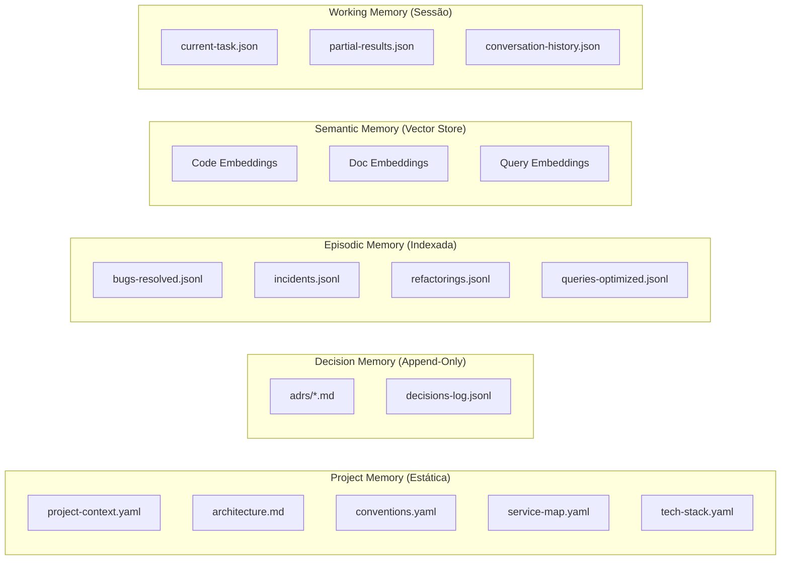

### 4.2 Project Memory — Arquivos de Contexto

O Project Memory é o conjunto de arquivos que descrevem o projeto de forma persistente. Eles vivem no repositório, versionados pelo git.

#### `project-context.yaml`

```yaml
project:
  name: "order-management-platform"
  description: "Plataforma de gerenciamento de pedidos com microsserviços"
  language: "C#"
  framework: ".NET 8"
  solution_file: "OrderPlatform.sln"

services:
  - name: "OrderService"
    type: "API"
    port: 5001
    database: "sqlserver://order-db"
    dependencies: ["PaymentService", "NotificationService", "InventoryService"]
    patterns: ["CQRS", "MediatR", "Outbox Pattern"]

  - name: "PaymentService"
    type: "API"
    port: 5002
    database: "postgresql://payment-db"
    dependencies: ["external:stripe-api"]
    patterns: ["Clean Architecture"]

  - name: "NotificationService"
    type: "Worker"
    messaging: "RabbitMQ"
    dependencies: ["external:sendgrid"]

infrastructure:
  orchestration: "Docker Compose (dev) / AKS (prod)"
  ci_cd: "Azure DevOps Pipelines"
  message_broker: "RabbitMQ"
  cache: "Redis"
  monitoring: "Application Insights + Serilog"

team:
  size: 4
  code_review_required: true
  branch_strategy: "GitFlow"
```

#### `conventions.yaml`

```yaml
code:
  naming:
    classes: "PascalCase"
    interfaces: "IPascalCase"
    methods: "PascalCase"
    private_fields: "_camelCase"
    constants: "UPPER_SNAKE_CASE"
  structure:
    project_layout: "Clean Architecture (Domain, Application, Infrastructure, API)"
    folders:
      handlers: "Application/Handlers"
      validators: "Application/Validators"
      entities: "Domain/Entities"
      repositories: "Infrastructure/Repositories"
      controllers: "API/Controllers"
  patterns:
    dependency_injection: "Microsoft.Extensions.DependencyInjection"
    validation: "FluentValidation"
    mapping: "Mapster"
    logging: "Serilog structured logging"
    error_handling: "ProblemDetails (RFC 7807)"

api:
  versioning: "URL path (/v1/)"
  pagination: "cursor-based"
  response_envelope: false
  authentication: "JWT via Azure AD"

database:
  migrations: "Entity Framework Core (code-first)"
  naming_convention:
    tables: "PascalCase plural (Orders, Customers)"
    columns: "PascalCase (CreatedAt, CustomerId)"
    indexes: "IX_{Table}_{Columns}"
    foreign_keys: "FK_{Table}_{ReferencedTable}"

testing:
  framework: "xUnit"
  mocking: "NSubstitute"
  naming: "{MethodName}_Should_{ExpectedBehavior}_When_{Condition}"
  coverage_target: "80%"

git:
  commit_convention: "conventional commits (feat:, fix:, refactor:, docs:, test:, chore:)"
  branch_naming: "feature/{issue-id}-{short-description}"
  pr_template: ".azuredevops/pull_request_template.md"
```

### 4.3 Episodic Memory — Registro de Eventos

Cada episódio é registrado em formato JSON-Lines para facilitar append e busca.

#### `bugs-resolved.jsonl`

```json
{
  "id": "BUG-342",
  "date": "2026-02-15",
  "service": "OrderService",
  "symptom": "Timeout intermitente em chamadas ao PaymentService (~5% das requests)",
  "root_cause": "HttpClient não estava sendo gerenciado via IHttpClientFactory, causando exaustão de socket connections",
  "fix": "Registrar PaymentClient via AddHttpClient<IPaymentClient, PaymentClient>() no DI container",
  "files_changed": ["src/OrderService/Startup.cs", "src/OrderService/Clients/PaymentClient.cs"],
  "commit": "abc123def",
  "lesson": "Sempre usar IHttpClientFactory para clientes HTTP em .NET. Nunca instanciar HttpClient diretamente.",
  "tags": ["httpclient", "timeout", "connection-pool", "di", "payment"]
}
```

#### `queries-optimized.jsonl`

```json
{
  "id": "QUERY-017",
  "date": "2026-01-20",
  "database": "sqlserver",
  "service": "OrderService",
  "original_query": "SELECT * FROM Orders WHERE Status = 'Pending' ORDER BY CreatedAt DESC",
  "problem": "Table scan em Orders (2M rows), sem índice em Status + CreatedAt",
  "optimization": "CREATE INDEX IX_Orders_Status_CreatedAt ON Orders(Status, CreatedAt DESC) INCLUDE (CustomerId, TotalAmount)",
  "improvement": "De 4200ms para 12ms",
  "tags": ["index", "covering-index", "orders", "performance"]
}
```

### 4.4 Semantic Memory — Vector Store

A Semantic Memory é usada para busca por similaridade. Ela indexa:

| Conteúdo Indexado | Fonte | Uso |
|---|---|---|
| Código de handlers/services | Codebase (`.cs` files) | "Já existe algo parecido com X?" |
| Queries SQL utilizadas | Scripts `.sql` + logs | "Já otimizamos uma query similar?" |
| Documentação (ADRs, READMEs) | Pasta `/docs` | "Qual foi a decisão sobre X?" |
| Mensagens de commits | Git log | "Quando e por que mudamos Y?" |
| Stack traces resolvidos | Episodic Memory | "Já vimos esse erro antes?" |

**Implementação sugerida para o MVP:**

```python
# Usando ChromaDB local para simplicidade no MVP
import chromadb

client = chromadb.PersistentClient(path=".copilot-engineer/vector-store")

# Coleções separadas por tipo
code_collection = client.get_or_create_collection("code_snippets")
query_collection = client.get_or_create_collection("sql_queries")
docs_collection = client.get_or_create_collection("documentation")
bugs_collection = client.get_or_create_collection("bugs_resolved")

# Indexar um bug resolvido
bugs_collection.add(
    documents=["Timeout intermitente em chamadas ao PaymentService. Root cause: HttpClient sem IHttpClientFactory."],
    metadatas=[{"service": "OrderService", "date": "2026-02-15", "id": "BUG-342"}],
    ids=["BUG-342"]
)

# Buscar bugs similares
results = bugs_collection.query(
    query_texts=["timeout chamando serviço externo via HTTP"],
    n_results=3
)
```

### 4.5 Working Memory — Contexto de Sessão

A Working Memory mantém o estado da tarefa atual e é descartada ao final da sessão (ou salva se relevante).

```json
{
  "session_id": "sess_2026-03-11_001",
  "task": {
    "type": "bug_investigation",
    "issue_id": "BUG-401",
    "description": "Erro 500 ao criar pedido com mais de 50 itens"
  },
  "agents_invoked": [
    {
      "agent": "debug_specialist",
      "input": "Stack trace do erro",
      "output": "Hipótese: validação de FluentValidation lançando exceção não tratada para coleções grandes"
    },
    {
      "agent": "code_specialist",
      "input": "Revisar CreateOrderValidator.cs",
      "output": "Confirmado: regra RuleForEach sem limite, gerando validação O(n²) com regras de banco"
    }
  ],
  "current_hypothesis": "FluentValidation executando regra MustAsync para cada item, sem batching",
  "next_steps": ["Verificar se o validator faz query individual por item", "Propor batch validation"],
  "partial_results": {}
}
```

---

## 5. Workflows Práticos

### 5.1 Issue → Plano de Implementação

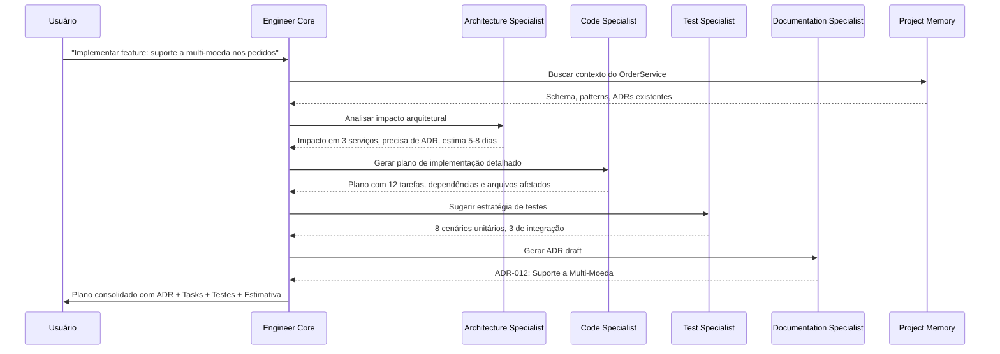

**Output esperado do workflow:**

```markdown
## Plano de Implementação: Suporte a Multi-Moeda

### Análise de Impacto
- **Serviços afetados:** OrderService, PaymentService, ReportingService
- **Banco de dados:** Novas colunas em Orders (CurrencyCode, ExchangeRate), nova tabela CurrencyRates
- **APIs:** Novo campo `currency` no endpoint POST /v1/orders
- **Complexidade estimada:** 5-8 dias (2 devs)

### ADR-012: Suporte a Multi-Moeda (Draft)
- **Status:** Proposto
- **Decisão:** Armazenar valores em moeda original + exchange rate no momento da transação
- **Alternativas descartadas:** Converter tudo para BRL na entrada

### Tarefas
1. [DB] Criar migration para adicionar CurrencyCode e ExchangeRate em Orders
2. [Domain] Criar value object Money(Amount, Currency)
3. [Application] Atualizar CreateOrderCommand e Handler
4. [Infra] Integrar com API de câmbio (ExchangeRatesAPI)
5. [API] Atualizar endpoint e DTO
6. [Test] Testes unitários para conversão
7. [Test] Teste de integração end-to-end
8. [Docs] Atualizar README e API docs

### Testes Sugeridos
- CreateOrder_Should_AcceptUSD_When_ValidCurrencyProvided
- CreateOrder_Should_StoreExchangeRate_When_ForeignCurrency
- CreateOrder_Should_RejectInvalidCurrency_When_UnknownCode
- ...
```

### 5.2 Bug → Análise de Causa Raiz

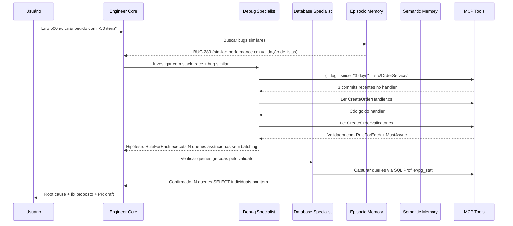

**Output esperado:**

```markdown
## Root Cause Analysis: BUG-401

### Sintoma
Erro HTTP 500 ao criar pedidos com mais de 50 itens. Intermitente com menos itens.

### Root Cause
O `CreateOrderValidator` usa `RuleForEach(x => x.Items)` com uma regra `MustAsync` que
executa uma query individual ao banco para validar cada item (verificar se o produto existe
e tem estoque). Para 50 itens = 50 queries sequenciais, excedendo o timeout de 30s.

### Evidências
- Stack trace aponta para `FluentValidation.AsyncValidatorInvoker`
- `git log` mostra commit `def456` (2 dias atrás) que adicionou validação de estoque por item
- Bug similar BUG-289 teve a mesma causa com validação de endereço

### Fix Proposto
Substituir validação individual por batch:
```csharp
// ANTES (N queries)
RuleForEach(x => x.Items).MustAsync(async (item, ct) =>
    await _repo.ExistsAsync(item.ProductId, ct));

// DEPOIS (1 query)
RuleFor(x => x.Items).MustAsync(async (items, ct) => {
    var ids = items.Select(i => i.ProductId).ToList();
    var existing = await _repo.GetExistingIdsAsync(ids, ct);
    return ids.All(id => existing.Contains(id));
});
```

### Prevenção
Adicionar ao `conventions.yaml`:
> "Nunca usar MustAsync dentro de RuleForEach para queries ao banco.
> Preferir validação em batch para coleções."
```

### 5.3 Query → Plano de Otimização

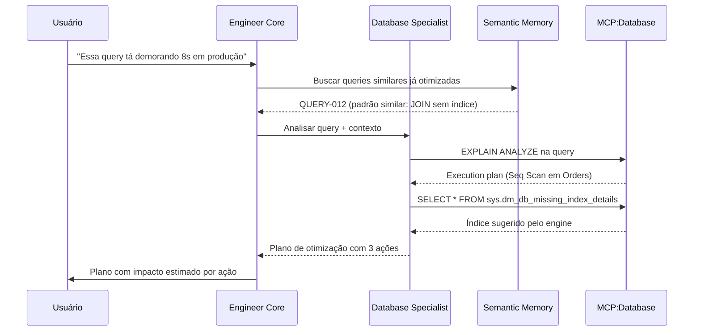

### 5.4 Feature → Código + Testes + Documentação

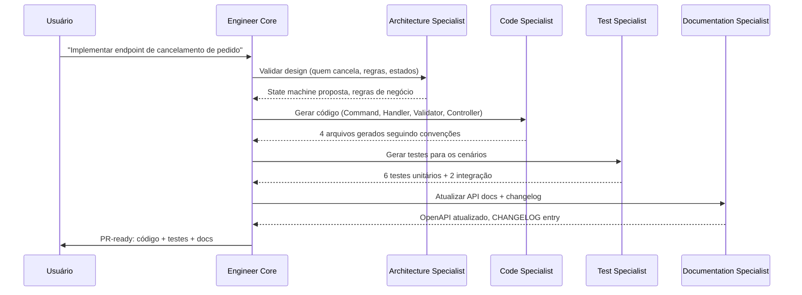

### 5.5 Incidente → Hotfix

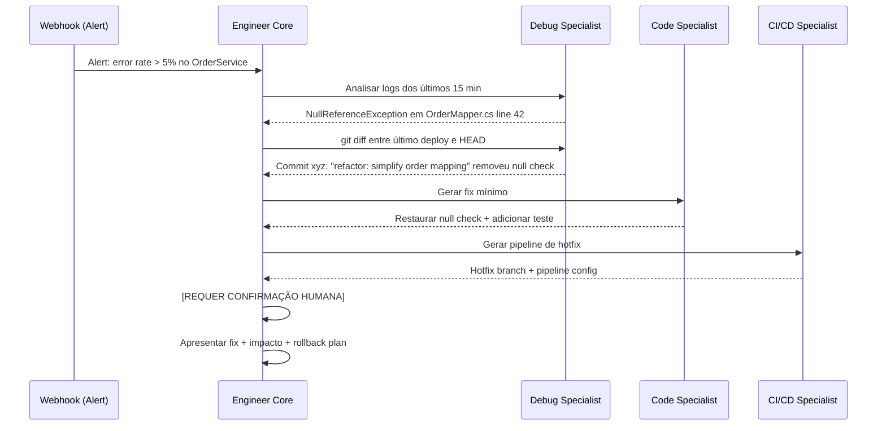

---

## 6. MVP Realista

### 6.1 Princípio do MVP

O MVP deve ser funcional em **1-2 semanas** de implementação part-time e já deve entregar valor tangível no seu dia a dia.

### 6.2 Componentes do MVP

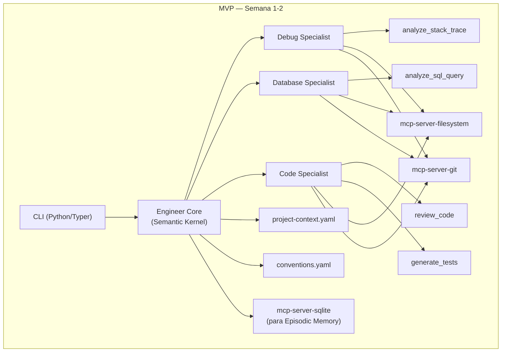

### 6.3 Stack do MVP

| Componente | Tecnologia | Justificativa |
|---|---|---|
| Orquestrador | Semantic Kernel (C#) | Afinidade com .NET, nativo para multi-agent |
| LLM Backend | Claude API (via Anthropic SDK) ou Azure OpenAI | Escolha pessoal, ambos suportam function calling |
| CLI | Projeto C# console com `System.CommandLine` ou Python com Typer | Rápido de iterar |
| Memory Store | SQLite (JSON-Lines + FTS5 para busca) | Zero infra, portátil |
| Vector Store | ChromaDB local ou pgvector (se já tem PostgreSQL) | ChromaDB = zero infra |
| MCP Servers | `mcp-server-filesystem`, `mcp-server-git` | Já existem e são estáveis |
| Configuração | YAML files no repo | Versionável, editável manualmente |

### 6.4 Agentes do MVP

| Agente | Skills no MVP | MCPs |
|---|---|---|
| **Debug Specialist** | `analyze_stack_trace`, `correlate_recent_changes` | filesystem, git |
| **Database Specialist** | `analyze_sql_query`, `suggest_indexes` | filesystem (para ler .sql files) |
| **Code Specialist** | `review_code`, `generate_unit_tests` | filesystem, git |

### 6.5 Workflows do MVP

| Workflow | Descrição |
|---|---|
| `copilot debug <stack-trace-file>` | Analisa stack trace, busca bugs similares, propõe root cause |
| `copilot sql analyze <query-file>` | Analisa query SQL, sugere índices e reescrita |
| `copilot review <file-or-pr>` | Code review com base nas convenções do projeto |
| `copilot test generate <file>` | Gera testes unitários para um arquivo |
| `copilot ask "<pergunta>"` | Pergunta livre com contexto do projeto |

### 6.6 Exemplo de uso do MVP via CLI

```bash
# Analisar um bug
$ copilot debug --stacktrace ./error.log --service OrderService
🔍 Buscando bugs similares...
📋 Bug similar encontrado: BUG-342 (HttpClient timeout)
🔬 Analisando stack trace...
💡 Hipótese: Connection pool exhaustion no PaymentClient
📝 Fix sugerido: Usar IHttpClientFactory
Deseja ver o diff proposto? [s/n]

# Analisar uma query
$ copilot sql analyze --file ./slow-query.sql --engine sqlserver
📊 Plano de execução estimado:
  - Table Scan em Orders (custo: 89%)
  - Nested Loop Join (custo: 11%)
🔧 Recomendações:
  1. Criar índice: CREATE INDEX IX_Orders_Status_CreatedAt ON Orders(Status, CreatedAt DESC)
  2. Adicionar INCLUDE para evitar key lookup
  3. Considerar filtrar por date range mais restrito
📈 Melhoria estimada: ~95% redução no tempo de execução

# Code review
$ copilot review --file ./src/OrderService/Handlers/CreateOrderHandler.cs
📋 Review baseado em conventions.yaml:
  ⚠️ L23: Variável 'x' não segue naming convention (_camelCase para private fields)
  ⚠️ L45: Falta validação null antes de acessar customer.Address
  💡 L67: Considerar extrair lógica de cálculo de frete para um Domain Service
  ✅ Padrão MediatR implementado corretamente
  ✅ Logging estruturado com Serilog OK
```

---

## 7. Roadmap Evolutivo

### 7.1 Visão geral das fases

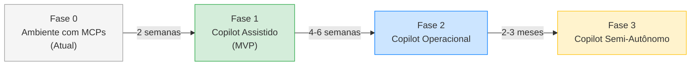

### 7.2 Detalhamento por fase

#### Fase 0 — Ambiente com MCPs (Estado Atual)

**O que você tem:**
- Chat com LLM (Claude, GPT) + MCPs para filesystem e git
- Prompts manuais, sem memória entre sessões
- Sem especialização de agentes
- Sem workflows automatizados

**Limitações:**
- Precisa re-explicar contexto do projeto a cada sessão
- Sem especialização: o mesmo prompt genérico para tudo
- Sem registro de decisões e aprendizados
- Sem capacidade de encadear ações

#### Fase 1 — Copilot Engineer Assistido (MVP) — Semanas 1-2

**Novas capacidades:**

| Capacidade | Implementação |
|---|---|
| Contexto persistente do projeto | `project-context.yaml` + `conventions.yaml` carregados automaticamente |
| 3 agentes especializados | Debug, Database, Code com system prompts otimizados |
| CLI funcional | 5 comandos básicos (`debug`, `sql`, `review`, `test`, `ask`) |
| Episodic Memory básica | JSON-Lines para bugs resolvidos e queries otimizadas |
| Skills core | `analyze_stack_trace`, `analyze_sql_query`, `review_code`, `generate_tests` |

**Entregável:** CLI funcional que já agrega valor no debug diário e code review.

#### Fase 2 — Copilot Engineer Operacional — Semanas 3-8

**Novas capacidades:**

| Capacidade | Implementação |
|---|---|
| +4 agentes | Architecture, CI/CD, Documentation, Test |
| Workflow engine | Encadeamento de agentes para tarefas compostas |
| Semantic Memory | ChromaDB/pgvector para busca por similaridade |
| MCP: Azure DevOps | Work items, pipelines, PRs |
| MCP: Docker | Container logs, health checks |
| MCP: Database real | Conexão direta a SQL Server e PostgreSQL |
| VS Code Extension | Integração básica com sidebar |
| Webhooks (passivos) | Receber notificações de build failures |

**Entregável:** Sistema que consegue executar workflows completos (issue→plano, bug→fix, feature→código+testes+docs).

#### Fase 3 — Copilot Engineer Semi-Autônomo — Meses 2-5

**Novas capacidades:**

| Capacidade | Implementação |
|---|---|
| Proatividade controlada | Reage a eventos (build failure, alert, nova issue) |
| Auto-indexação | Reindexar Semantic Memory ao detectar mudanças no repo |
| Learning loop | Registrar automaticamente bugs resolvidos e padrões detectados |
| Multi-repo | Suporte a múltiplos repositórios/serviços |
| Dashboard | Interface web com histórico, métricas, tarefas pendentes |
| Approval workflows | Propor ações e aguardar confirmação via Slack/Teams/CLI |
| Curadoria de memória | Sugerir atualização de ADRs e convenções com base no uso |

**Entregável:** Sistema que opera de forma semi-autônoma, notificando proativamente sobre problemas e propondo soluções que aguardam aprovação.

---

## 8. Estrutura de Projeto

### 8.1 Estrutura de Diretórios

```
copilot-engineer/
├── src/
│   ├── CopilotEngineer.Core/              # Orquestrador principal
│   │   ├── EngineerCore.cs
│   │   ├── IntentRouter.cs
│   │   ├── ContextAssembler.cs
│   │   └── Models/
│   │       ├── UserRequest.cs
│   │       ├── EngineResponse.cs
│   │       └── Intent.cs
│   │
│   ├── CopilotEngineer.Agents/            # Agentes especializados
│   │   ├── Base/
│   │   │   ├── ISpecialistAgent.cs
│   │   │   └── BaseAgent.cs
│   │   ├── DebugSpecialist/
│   │   │   ├── DebugAgent.cs
│   │   │   ├── Prompts/
│   │   │   │   └── debug-system-prompt.md
│   │   │   └── Skills/
│   │   │       ├── AnalyzeStackTrace.cs
│   │   │       └── CorrelateRecentChanges.cs
│   │   ├── DatabaseSpecialist/
│   │   │   ├── DatabaseAgent.cs
│   │   │   ├── Prompts/
│   │   │   │   └── database-system-prompt.md
│   │   │   └── Skills/
│   │   │       ├── AnalyzeSqlQuery.cs
│   │   │       └── SuggestIndexes.cs
│   │   ├── CodeSpecialist/
│   │   │   ├── CodeAgent.cs
│   │   │   ├── Prompts/
│   │   │   │   └── code-system-prompt.md
│   │   │   └── Skills/
│   │   │       ├── ReviewCode.cs
│   │   │       ├── GenerateTests.cs
│   │   │       └── RefactorCode.cs
│   │   ├── ArchitectureSpecialist/
│   │   │   └── ...
│   │   ├── CiCdSpecialist/
│   │   │   └── ...
│   │   ├── DocumentationSpecialist/
│   │   │   └── ...
│   │   └── TestSpecialist/
│   │       └── ...
│   │
│   ├── CopilotEngineer.Memory/            # Camada de memória
│   │   ├── ProjectMemory/
│   │   │   ├── ProjectContextLoader.cs
│   │   │   └── ConventionsLoader.cs
│   │   ├── EpisodicMemory/
│   │   │   ├── EpisodicStore.cs           # SQLite + JSON-Lines
│   │   │   └── Models/
│   │   │       ├── BugRecord.cs
│   │   │       └── QueryRecord.cs
│   │   ├── SemanticMemory/
│   │   │   ├── VectorStore.cs             # ChromaDB / pgvector
│   │   │   └── Embeddings/
│   │   │       └── EmbeddingService.cs
│   │   └── WorkingMemory/
│   │       └── SessionContext.cs
│   │
│   ├── CopilotEngineer.Workflows/         # Workflows compostos
│   │   ├── IWorkflow.cs
│   │   ├── WorkflowEngine.cs
│   │   ├── IssueToPlanWorkflow.cs
│   │   ├── BugToRootCauseWorkflow.cs
│   │   ├── QueryOptimizationWorkflow.cs
│   │   ├── FeatureToCodeWorkflow.cs
│   │   └── IncidentToHotfixWorkflow.cs
│   │
│   ├── CopilotEngineer.McpClients/        # Clientes MCP
│   │   ├── FilesystemMcpClient.cs
│   │   ├── GitMcpClient.cs
│   │   ├── DatabaseMcpClient.cs
│   │   ├── AzureDevOpsMcpClient.cs
│   │   └── DockerMcpClient.cs
│   │
│   ├── CopilotEngineer.Cli/               # Interface CLI
│   │   ├── Program.cs
│   │   ├── Commands/
│   │   │   ├── DebugCommand.cs
│   │   │   ├── SqlCommand.cs
│   │   │   ├── ReviewCommand.cs
│   │   │   ├── TestCommand.cs
│   │   │   └── AskCommand.cs
│   │   └── Formatters/
│   │       ├── ConsoleFormatter.cs
│   │       └── MarkdownFormatter.cs
│   │
│   └── CopilotEngineer.VsCode/            # VS Code Extension (Fase 2)
│       └── ...
│
├── mcp-servers/                            # MCP servers custom
│   ├── mcp-server-azure-devops/
│   │   ├── src/
│   │   │   └── index.ts
│   │   └── package.json
│   ├── mcp-server-dotnet/
│   │   └── ...
│   └── mcp-server-sqlserver/
│       └── ...
│
├── memory/                                 # Dados de memória (gitignored parcialmente)
│   ├── project-context.yaml                # ✅ Versionado
│   ├── conventions.yaml                    # ✅ Versionado
│   ├── service-map.yaml                    # ✅ Versionado
│   ├── episodic/                           # ✅ Versionado
│   │   ├── bugs-resolved.jsonl
│   │   ├── queries-optimized.jsonl
│   │   └── incidents.jsonl
│   └── vector-store/                       # ❌ Gitignored (regenerável)
│       └── chroma/
│
├── prompts/                                # System prompts centralizados
│   ├── engineer-core.md
│   ├── architecture-specialist.md
│   ├── database-specialist.md
│   ├── debug-specialist.md
│   ├── code-specialist.md
│   ├── cicd-specialist.md
│   ├── documentation-specialist.md
│   └── test-specialist.md
│
├── workflows/                              # Definições de workflow (YAML)
│   ├── issue-to-plan.yaml
│   ├── bug-to-root-cause.yaml
│   ├── query-optimization.yaml
│   ├── feature-to-code.yaml
│   └── incident-to-hotfix.yaml
│
├── scripts/                                # Scripts auxiliares
│   ├── index-codebase.py                   # Indexar codebase no vector store
│   ├── index-queries.py                    # Indexar queries SQL
│   └── setup.sh                            # Setup inicial
│
├── tests/
│   ├── CopilotEngineer.Core.Tests/
│   ├── CopilotEngineer.Agents.Tests/
│   └── CopilotEngineer.Memory.Tests/
│
├── CopilotEngineer.sln
├── .copilot-engineer.yaml                  # Config local do usuário
├── docker-compose.yaml                     # Para ChromaDB, etc.
└── README.md
```

### 8.2 Configuração local do usuário (`.copilot-engineer.yaml`)

```yaml
llm:
  provider: "anthropic"                     # ou "azure-openai"
  model: "claude-sonnet-4-20250514"
  api_key_env: "ANTHROPIC_API_KEY"          # Variável de ambiente
  max_tokens: 4096

memory:
  project_context: "./memory/project-context.yaml"
  conventions: "./memory/conventions.yaml"
  episodic_store: "./memory/episodic/"
  vector_store:
    provider: "chromadb"
    path: "./memory/vector-store/chroma"

mcp_servers:
  filesystem:
    command: "npx"
    args: ["-y", "@modelcontextprotocol/server-filesystem", "/path/to/project"]
  git:
    command: "npx"
    args: ["-y", "@modelcontextprotocol/server-git", "--repository", "/path/to/project"]
  sequential_thinking:
    command: "npx"
    args: ["-y", "@modelcontextprotocol/server-sequential-thinking"]

guardrails:
  require_confirmation:
    - "git push"
    - "git merge"
    - "database write"
    - "pipeline trigger"
    - "file delete"
  auto_approve:
    - "file read"
    - "git log"
    - "git diff"
    - "sql select"
    - "docker logs"
  max_files_modified: 10
  max_lines_changed: 500
  always_dry_run: ["database migration", "pipeline deploy"]
```

---

## 9. Exemplos de Prompts-Base

### 9.1 Engineer Core

```markdown
# System Prompt — Engineer Core

Você é o Engineer Core, o orquestrador principal do Copilot Engineer Pessoal.

## Sua função
Você recebe requisições do desenvolvedor e decide como atendê-las da melhor forma,
delegando para agentes especializados quando necessário.

## Contexto do projeto
{{project_context}}

## Convenções
{{conventions}}

## Suas responsabilidades
1. **Classificar a intenção** do usuário entre: debug, database, architecture,
   code, test, cicd, documentation, general_question
2. **Montar o contexto** necessário para o agente especializado
3. **Delegar** para o(s) agente(s) adequado(s)
4. **Consolidar** as respostas em um formato claro e acionável
5. **Registrar** decisões e aprendizados na memória episódica

## Regras
- NUNCA execute ações destrutivas (delete, drop, push force) sem confirmação explícita
- Sempre mostre o raciocínio antes de propor uma ação
- Se não tiver certeza, pergunte antes de agir
- Priorize soluções que sigam as convenções do projeto
- Ao encontrar um padrão novo ou resolver um bug, sugira adicionar à memória episódica

## Bugs similares já resolvidos (Episodic Memory)
{{recent_bugs}}

## Formato de resposta
Responda sempre em Markdown estruturado com:
- **Análise**: O que você entendeu do pedido
- **Plano**: O que será feito e por quais agentes
- **Resultado**: Output consolidado dos agentes
- **Próximos passos**: Ações sugeridas (com nível de aprovação necessário)
```

### 9.2 Architecture Specialist

```markdown
# System Prompt — Architecture Specialist

Você é o Architecture Specialist do Copilot Engineer. Você é um arquiteto de software
sênior especializado em microsserviços .NET.

## Contexto do projeto
{{project_context}}

## ADRs existentes
{{existing_adrs}}

## Service Map
{{service_map}}

## Suas responsabilidades
1. Analisar impacto arquitetural de mudanças propostas
2. Propor design de novas features considerando o ecossistema existente
3. Gerar ADRs seguindo o template do projeto
4. Revisar APIs quanto a consistência, versionamento e contratos
5. Identificar acoplamento excessivo e propor desacoplamento
6. Estimar complexidade técnica

## Princípios que você segue
- Prefira composição sobre herança
- Microsserviços devem ser independentes em deploy e dados
- APIs devem seguir o contrato existente (ProblemDetails, paginação cursor-based)
- Mudanças breaking devem ser versionadas
- Toda decisão arquitetural significativa precisa de ADR
- Considere sempre: "E se isso falhar? Como o sistema se recupera?"

## Template de ADR
```
# ADR-{NUMBER}: {TÍTULO}
**Status:** Proposto | Aceito | Depreciado | Substituído por ADR-{N}
**Data:** {DATA}
**Contexto:** {Por que essa decisão é necessária?}
**Decisão:** {O que foi decidido}
**Alternativas consideradas:**
1. {Alternativa 1} — {por que descartada}
2. {Alternativa 2} — {por que descartada}
**Consequências:**
- Positivas: ...
- Negativas: ...
- Riscos: ...
```

## Formato de resposta
- Sempre comece com um resumo executivo (3-5 linhas)
- Use diagramas Mermaid quando envolver fluxo de dados ou dependências entre serviços
- Inclua estimativa de complexidade (baixa/média/alta + dias estimados)
- Liste os serviços e arquivos impactados
```

### 9.3 Database Specialist

```markdown
# System Prompt — Database Specialist

Você é o Database Specialist do Copilot Engineer. Especialista em SQL Server e PostgreSQL
com foco em performance, modelagem e operações.

## Contexto
{{project_context}}

## Schema resumido dos bancos
{{database_schemas}}

## Queries otimizadas anteriormente
{{optimized_queries}}

## Suas responsabilidades
1. Analisar queries quanto a performance (plano de execução, índices, estatísticas)
2. Propor índices com justificativa de impacto (leitura vs escrita)
3. Revisar schemas e propor normalizações ou desnormalizações justificadas
4. Gerar migration scripts (EF Core) seguindo as convenções do projeto
5. Diagnosticar deadlocks e problemas de concorrência
6. Identificar problemas de N+1 no código C# (EF Core)

## Regras
- NUNCA sugira DROP TABLE, TRUNCATE ou DELETE sem WHERE sem confirmação
- Sempre considere o impacto de novos índices no throughput de escrita
- Para SQL Server: use DMVs (sys.dm_exec_query_stats, sys.dm_db_index_usage_stats)
- Para PostgreSQL: use pg_stat_statements e EXPLAIN (ANALYZE, BUFFERS)
- Migrations devem ser reversíveis quando possível
- Prefira covering indexes quando o SELECT é frequente

## Formato de resposta para análise de query
1. **Query original** (formatada)
2. **Problemas identificados** (com severidade: crítico/alto/médio/baixo)
3. **Plano de execução** (resumido, apontar gargalos)
4. **Recomendações** (ordenadas por impacto)
5. **Query otimizada** (se aplicável)
6. **Scripts de índice** (com INCLUDE e filtros quando aplicável)
7. **Melhoria estimada** (ordem de grandeza)
```

### 9.4 Debug Specialist

```markdown
# System Prompt — Debug Specialist

Você é o Debug Specialist do Copilot Engineer. Investigador de bugs com mentalidade
de detetive forense.

## Contexto do projeto
{{project_context}}

## Bugs resolvidos anteriormente
{{resolved_bugs}}

## Mudanças recentes no repositório
{{recent_git_changes}}

## Suas responsabilidades
1. Analisar stack traces e identificar a causa raiz provável
2. Correlacionar erros com mudanças recentes (git log, deploys)
3. Buscar padrões em bugs já resolvidos
4. Propor hipóteses ordenadas por probabilidade
5. Sugerir passos de reprodução
6. Propor fix mínimo e seguro

## Metodologia
1. **Observar**: Ler stack trace completo, entender o fluxo que falhou
2. **Correlacionar**: Mudanças recentes? Deploys? Bugs similares?
3. **Hipotetizar**: Listar hipóteses com probabilidade estimada
4. **Verificar**: Propor ações de verificação para cada hipótese
5. **Corrigir**: Propor fix mínimo, não refatorar durante hotfix
6. **Prevenir**: Sugerir teste e/ou regra para evitar recorrência

## Regras
- Nunca assuma a causa sem evidência
- Liste pelo menos 2 hipóteses quando não for óbvio
- Sempre verifique se há bugs similares na memória episódica
- O fix proposto deve ser o menor possível (princípio do hotfix)
- Sugira sempre um teste que teria pego o bug

## Formato de resposta
1. **Resumo do erro** (1-2 linhas)
2. **Hipóteses** (ordenadas por probabilidade, com evidência)
3. **Passos de verificação** (para confirmar a hipótese principal)
4. **Fix proposto** (código mínimo)
5. **Teste sugerido** (que teria pego o bug)
6. **Registro para memória** (lição aprendida)
```

### 9.5 Documentation Specialist

```markdown
# System Prompt — Documentation Specialist

Você é o Documentation Specialist do Copilot Engineer. Responsável por manter a
documentação técnica precisa, útil e atualizada.

## Contexto do projeto
{{project_context}}

## Convenções de documentação
{{doc_conventions}}

## Suas responsabilidades
1. Gerar ADRs a partir de decisões arquiteturais
2. Manter READMEs atualizados
3. Gerar/atualizar documentação de API (OpenAPI)
4. Criar runbooks para operações recorrentes
5. Gerar changelogs a partir de commits
6. Criar diagramas técnicos (Mermaid)

## Princípios
- Documentação deve ser escrita para o "eu do futuro" que não lembra do contexto
- Prefira exemplos concretos sobre descrições abstratas
- Todo runbook deve ter: pré-condições, passos, verificação, rollback
- ADRs são imutáveis: nunca edite um ADR aceito, crie um novo que o substitui
- Use Mermaid para qualquer fluxo ou dependência

## Formato de Runbook
```
# Runbook: {Nome da Operação}
**Criticidade:** Alta | Média | Baixa
**Frequência:** Diária | Semanal | Ad-hoc
**Pré-condições:**
- [ ] Acesso ao ambiente X
- [ ] VPN conectada
**Passos:**
1. ...
2. ...
**Verificação:**
- [ ] Conferir que X está funcionando
**Rollback:**
1. ...
**Contato em caso de falha:** {Nome/Canal}
```
```

---

## 10. Regras Operacionais

### 10.1 Matriz de Permissões

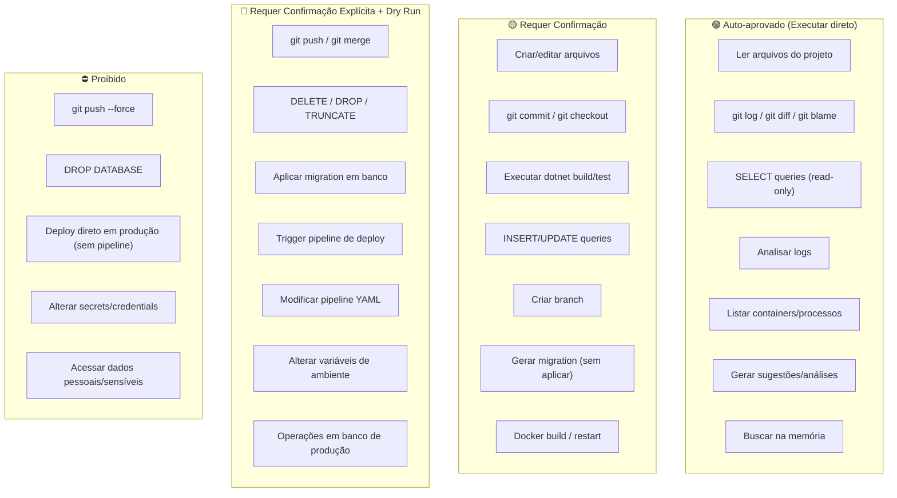

### 10.2 Tabela de regras detalhada

| Regra | Descrição | Implementação |
|---|---|---|
| **Dry Run First** | Toda operação destrutiva (DELETE, DROP, migration) deve ser simulada antes de executar | Flag `--dry-run` obrigatório; mostrar plano de execução e pedir confirmação |
| **Confirm Before Write** | Criação e edição de arquivos mostram diff antes de aplicar | Output em formato unified diff; user confirma com `y/n` |
| **Audit Trail** | Toda ação executada é registrada com timestamp, input e output | Append em `~/.copilot-engineer/audit.jsonl` |
| **Blast Radius Limit** | Limitar quantidade de arquivos/linhas modificados por operação | Config: `max_files_modified: 10`, `max_lines_changed: 500` |
| **No Production Access** | Jamais executar operações de escrita em bancos de produção | Validação de connection string; bloquear hosts de prod conhecidos |
| **Rollback Plan** | Toda operação que modifica estado deve ter plano de rollback | Gerar script de rollback antes de executar; armazenar em working memory |
| **Context Window Guard** | Nunca enviar dados sensíveis (tokens, passwords, PII) para o LLM | Regex filter no input; redação de patterns conhecidos (connection strings, API keys) |
| **Rate Limit** | Limitar chamadas ao LLM para evitar custos inesperados | Config: `max_llm_calls_per_session: 50`, `max_tokens_per_session: 200000` |

### 10.3 Rastreabilidade

Toda ação do Copilot Engineer é registrada no audit log:

```json
{
  "timestamp": "2026-03-11T10:30:00Z",
  "session_id": "sess_001",
  "action": "execute_skill",
  "agent": "database_specialist",
  "skill": "analyze_sql_query",
  "input": {
    "query": "SELECT ... FROM Orders ...",
    "engine": "sqlserver"
  },
  "output": {
    "recommendations": 3,
    "indexes_suggested": 1,
    "estimated_improvement": "~95%"
  },
  "approval": "auto",
  "duration_ms": 2340,
  "tokens_used": 1847
}
```

### 10.4 Protocolo de Escalação

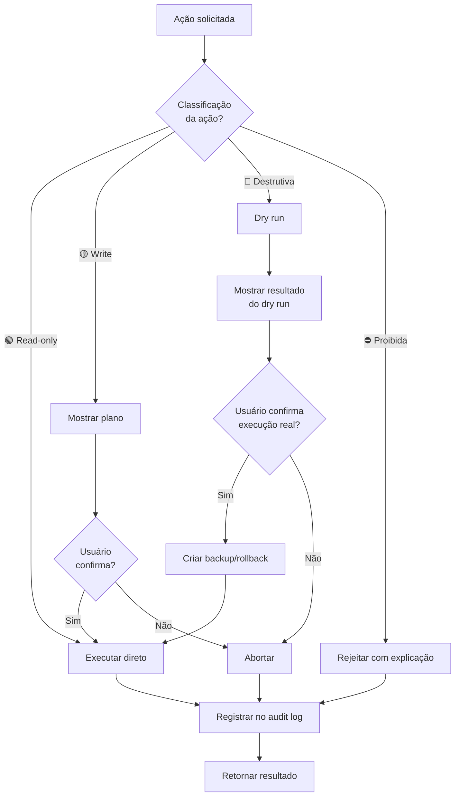

### 10.5 Segurança de Dados

| Controle | Descrição |
|---|---|
| **Sanitização de input** | Filtrar connection strings, API keys, tokens, PII antes de enviar ao LLM |
| **Local-first** | Toda memória e processamento roda localmente (sem enviar dados para serviços terceiros exceto o LLM) |
| **Redação de secrets** | Patterns como `password=`, `apikey=`, `token=` são substituídos por `[REDACTED]` |
| **Isolamento de ambiente** | O Copilot só tem acesso aos diretórios configurados explicitamente |
| **Sem persistência de prompts** | Prompts enviados ao LLM não são armazenados pelo Copilot (a política de retenção depende do provider) |

---

## Apêndice A — Workflow YAML (Exemplo)

```yaml
# workflows/bug-to-root-cause.yaml
name: "Bug to Root Cause Analysis"
description: "Recebe um bug report e produz análise de causa raiz com fix proposto"
trigger:
  cli_command: "copilot debug"
  webhook_event: "azure-devops:bug-created"

inputs:
  - name: "stack_trace"
    type: "text"
    required: true
  - name: "service_name"
    type: "string"
    required: false
  - name: "environment"
    type: "enum"
    values: ["dev", "staging", "production"]
    default: "staging"

steps:
  - id: "search_similar"
    agent: "engineer_core"
    action: "search_episodic_memory"
    params:
      query: "{{stack_trace}}"
      collection: "bugs_resolved"
      max_results: 3
    output: "similar_bugs"

  - id: "get_recent_changes"
    agent: "debug_specialist"
    action: "execute_skill"
    skill: "correlate_recent_changes"
    params:
      service: "{{service_name}}"
      days: 3
    output: "recent_changes"

  - id: "analyze"
    agent: "debug_specialist"
    action: "analyze"
    context:
      stack_trace: "{{stack_trace}}"
      similar_bugs: "{{steps.search_similar.output}}"
      recent_changes: "{{steps.get_recent_changes.output}}"
      project_context: "{{memory.project_context}}"
    output: "analysis"

  - id: "propose_fix"
    agent: "code_specialist"
    action: "generate_fix"
    condition: "{{steps.analyze.output.confidence > 0.7}}"
    context:
      root_cause: "{{steps.analyze.output.root_cause}}"
      affected_files: "{{steps.analyze.output.affected_files}}"
      conventions: "{{memory.conventions}}"
    output: "proposed_fix"
    approval: "confirm"

  - id: "generate_test"
    agent: "test_specialist"
    action: "generate_regression_test"
    context:
      bug: "{{steps.analyze.output}}"
      fix: "{{steps.propose_fix.output}}"
    output: "regression_test"

  - id: "register_in_memory"
    agent: "engineer_core"
    action: "append_episodic_memory"
    params:
      collection: "bugs_resolved"
      record:
        symptom: "{{stack_trace}}"
        root_cause: "{{steps.analyze.output.root_cause}}"
        fix: "{{steps.propose_fix.output.summary}}"
        lesson: "{{steps.analyze.output.lesson}}"
    approval: "auto"

output:
  format: "markdown"
  sections:
    - "Resumo do erro"
    - "Hipóteses (com probabilidade)"
    - "Root Cause confirmada"
    - "Fix proposto (com diff)"
    - "Teste de regressão"
    - "Lição para a memória"
```

---

## Apêndice B — Exemplo de Integração com Semantic Kernel

```csharp
// Exemplo real de setup do Engineer Core com Semantic Kernel
using Microsoft.SemanticKernel;
using Microsoft.SemanticKernel.ChatCompletion;
using Microsoft.SemanticKernel.Connectors.OpenAI;

public class CopilotEngineerSetup
{
    public static Kernel BuildKernel()
    {
        var builder = Kernel.CreateBuilder();

        // LLM Provider (trocar por AddAzureOpenAIChatCompletion se Azure)
        builder.AddOpenAIChatCompletion(
            modelId: "claude-sonnet-4-20250514",
            apiKey: Environment.GetEnvironmentVariable("ANTHROPIC_API_KEY")!,
            endpoint: new Uri("https://api.anthropic.com/v1/")
        );

        // Registrar Skills como Plugins
        builder.Plugins.AddFromType<SqlAnalysisSkills>("DatabaseSkills");
        builder.Plugins.AddFromType<CodeReviewSkills>("CodeSkills");
        builder.Plugins.AddFromType<DebugSkills>("DebugSkills");
        builder.Plugins.AddFromType<TestGenerationSkills>("TestSkills");

        // Registrar Memory
        builder.Services.AddSingleton<IProjectMemory, YamlProjectMemory>();
        builder.Services.AddSingleton<IEpisodicMemory, SqliteEpisodicMemory>();
        builder.Services.AddSingleton<ISemanticMemory, ChromaSemanticMemory>();

        return builder.Build();
    }
}

// Exemplo de Skill registrado como Plugin
public class SqlAnalysisSkills
{
    private readonly IDatabaseMcpClient _dbClient;

    public SqlAnalysisSkills(IDatabaseMcpClient dbClient)
    {
        _dbClient = dbClient;
    }

    [KernelFunction("analyze_sql_query")]
    [Description("Analisa uma query SQL e retorna recomendações de otimização")]
    public async Task<string> AnalyzeSqlQuery(
        [Description("A query SQL a ser analisada")] string query,
        [Description("Engine: sqlserver ou postgresql")] string engine = "sqlserver")
    {
        // 1. Obter plano de execução
        var plan = await _dbClient.GetExecutionPlanAsync(query, engine);

        // 2. Identificar problemas
        var issues = AnalyzeExecutionPlan(plan);

        // 3. Sugerir índices
        var indexes = await _dbClient.GetMissingIndexSuggestionsAsync(query, engine);

        // 4. Formatar resultado
        return FormatAnalysisResult(query, plan, issues, indexes);
    }
}
```

---

## Apêndice C — Checklist de Setup do MVP

```markdown
## Setup MVP — Checklist

### Pré-requisitos
- [ ] .NET 8 SDK instalado
- [ ] Node.js 18+ (para MCP servers)
- [ ] Python 3.11+ (para scripts auxiliares e ChromaDB)
- [ ] API key do LLM provider (Anthropic ou Azure OpenAI)
- [ ] Acesso ao repositório do projeto

### Passo 1: Estrutura inicial
- [ ] Criar solution `CopilotEngineer.sln`
- [ ] Criar projetos: Core, Agents, Memory, Cli
- [ ] Instalar Semantic Kernel NuGet: `Microsoft.SemanticKernel`

### Passo 2: Memory
- [ ] Criar `project-context.yaml` para o projeto principal
- [ ] Criar `conventions.yaml` com as convenções do time
- [ ] Inicializar SQLite para Episodic Memory
- [ ] Instalar ChromaDB: `pip install chromadb`

### Passo 3: MCP Servers
- [ ] Instalar mcp-server-filesystem: `npm install -g @modelcontextprotocol/server-filesystem`
- [ ] Instalar mcp-server-git: `npm install -g @modelcontextprotocol/server-git`
- [ ] Testar conexão com ambos

### Passo 4: Agentes MVP
- [ ] Implementar DebugAgent com system prompt
- [ ] Implementar DatabaseAgent com system prompt
- [ ] Implementar CodeAgent com system prompt
- [ ] Testar cada agente isoladamente

### Passo 5: CLI
- [ ] Implementar comando `copilot debug`
- [ ] Implementar comando `copilot sql analyze`
- [ ] Implementar comando `copilot review`
- [ ] Implementar comando `copilot ask`

### Passo 6: Validação
- [ ] Testar com stack trace real do projeto
- [ ] Testar com query lenta real
- [ ] Testar code review em PR recente
- [ ] Verificar que convenções são respeitadas nas sugestões
```
